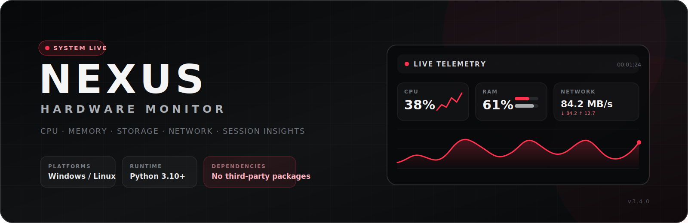

<p align="center">
  
</p>

<p align="center">
  
  
  
</p>

NEXUS is a live hardware dashboard I built for checking the stuff I actually care about without opening five different apps. CPU, memory, storage, battery, network traffic, and session stats are all in one place, with a compact desktop HUD when you only want the essentials.

It runs on **Windows and Linux**, uses the information your operating system already exposes, and does not need any third-party Python packages.

## What it can do

- Show live CPU, RAM, storage, battery, uptime, and system information
- Track download/upload speeds, session totals, peaks, and connected physical adapters
- Draw auto-scaling 60-second graphs for system and network activity
- Record one sample per second in **Session Insights**, with pause/reset controls and CSV export
- Switch into a draggable, always-on-top **Desktop HUD** with CPU and RAM sparklines
- Display multiple Windows drives or Linux mount points in a scrollable storage view
- Output a readable command-line snapshot or raw JSON
- Run built-in CPU calculation, temporary-file integrity, and unit tests

> [!NOTE]
> NEXUS reads system counters—it does not inspect packets, upload telemetry, or send your hardware data anywhere.

## Run it

### Windows

The easiest way is to double-click:

```text
run_hardware_monitor.bat
```

Or launch it from PowerShell inside the project folder:

```powershell
python -m hardware_monitor.gui
```

You can also use `pythonw -m hardware_monitor.gui` if you do not want a console window left open behind it.

### Linux

Make sure Tkinter is installed, then run:

```bash
python3 -m hardware_monitor.gui
```

The included launcher works too:

```bash
chmod +x run_hardware_monitor.sh
./run_hardware_monitor.sh
```

On Debian or Ubuntu, install Tkinter with:

```bash
sudo apt update
sudo apt install python3-tk
```

## Compact HUD

Click **COMPACT MODE** to switch from the full dashboard to the desktop HUD.

You can drag it by the title, change the opacity between 70%, 85%, and 100%, and snap it to the top-right of your desktop. Click **RESTORE** or press `Esc` to go back to the main window.

## Command line

A full GUI is not required for the snapshot, JSON output, or quick self-test.

```bash
# Human-readable system snapshot
python -m hardware_monitor.main

# Raw JSON snapshot
python -m hardware_monitor.main --json

# CPU and temporary-file checks
python -m hardware_monitor.main --test
```

Use `python3` instead of `python` on Linux if that is how Python is installed on your system.

## Tests

```bash
python -m unittest discover -v
```

The test suite covers the platform parsers, CPU and disk checks, network rate tracking, counter resets, session recording, alert thresholds, retention limits, CSV export, and GUI helper functions.

## How the readings work

Windows readings come from native system APIs and the registry where needed. Linux readings come from standard sources such as `/proc`, `/sys`, mounted filesystems, and local system commands.

Network speeds are calculated from the change in each physical adapter's 64-bit byte counters between samples. Virtual-only interfaces such as TUN/TAP devices, bridges, and container links are skipped so the same traffic is not counted twice.

A few things worth knowing:

- **Link speed is not an internet speed test.** It is the adapter's connection speed to your router, switch, or access point.
- Network totals include local traffic, internet traffic, background apps, and VPN overhead on the physical connection.
- Reconnects and counter resets start a new baseline instead of creating a fake spike.
- Session totals start when NEXUS starts; they are not lifetime totals.
- Storage is shown in GiB, where 1 GiB is 1,073,741,824 bytes.

## Session Insights

NEXUS keeps the latest **86,400 samples** for CSV export, which is roughly 24 hours at the normal one-second refresh rate. The on-screen averages, peaks, and totals continue for the whole session even after older export rows roll off.

The built-in alerts use simple information thresholds:

- CPU at 85% or higher
- RAM at 85% or higher
- Any detected storage volume at 90% capacity or higher

These alerts are a heads-up, not a hardware-health diagnosis.

## Latest update — v3.4

The current release focuses on making the interface feel smoother without making the monitor itself heavy:

- Reworked graphite black-and-white design with restrained red accents
- Canvas-drawn rounded panels, tabs, buttons, gauges, graphs, cards, and HUD cells
- Smoother drive-capacity, hover, press, focus, gauge, graph, and sparkline animations
- Better font fallbacks across Windows and Linux
- One capped animation clock instead of lots of separate animation loops
- Background animation pauses when tabs are hidden or the window is minimized

Linux support added in v3.3 includes native CPU, memory, storage, uptime, battery, and physical network-adapter readings using `/proc`, `/sys`, and other local operating-system sources.

## Compatibility

**Officially supported:** Windows 10/11 and modern Linux distributions with Python 3.10+.

macOS and other systems may open through generic fallbacks, but they are not officially supported and some readings will be unavailable. Hardware details also depend on what the operating system, permissions, firmware, and drivers expose.

Temperature, voltage, power draw, and fan RPM are not currently shown because NEXUS does not yet use a trusted cross-platform sensor provider. Window opacity, borderless mode, always-on-top behaviour, and exact multi-monitor placement can also vary between Linux desktop environments, X11, and Wayland.

## Project layout

```text
hardware_monitor/
├── gui.py        # Main dashboard and Desktop HUD
├── main.py       # CLI snapshot, JSON output, and self-test entry point
├── monitor.py    # Cross-platform hardware and OS data collection
├── network.py    # Adapter rate tracking, totals, peaks, and formatting
└── recorder.py   # Session samples, summaries, alerts, and CSV export

tests/            # Unit tests for monitoring, networking, recording, and GUI helpers
```

---

Made by [Kieranmcm07](https://github.com/Kieranmcm07). If NEXUS is useful to you, leaving the repo a star would be appreciated.
